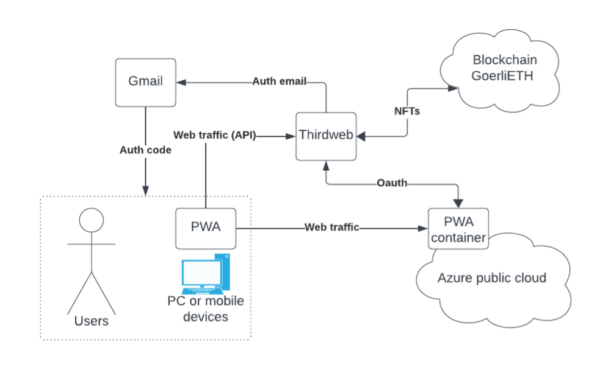

# Progressive web application

## Context diagram
The context diagram below illustrates the entities within the solution and demonstrates the data flow between them.

## Entities
1. Users - Individuals utilizing this solution.
2. PWA - Installed Progressive Web App on a PC or mobile device.
3. PWA container - A virtualized container-based application (Next JS + PWA + application code).
4. Azure public cloud - A public cloud platform used for hosting the project application.
5. Thirdweb - External services for authentication and Blockchain services.
6. Blockchain GeorliETH - One of the TestNet blockchain networks.
7. Gmail - Receiving authentication codes from Thirdweb for secret code authentication.

## Use cases
Use Case 1: When users visits the front page, they will see an icon adjacent to the navigation bar, it enables the Progressive Web App (PWA) installation on both desktop and mobile devices. This feature aims to deliver a native app-like experience to the end user.
 
Use Case 2: On the front page, when a user is not authenticated, they will see the login button, and the page will adapt to various screen sizes.
 
Use Case 3: Authentication involves email verification.

Use Case 4: Once the user is successfully authenticated, the webpage will display images of my NFTs.
